# Tech Assignment

This repository contains solution for the Tech Assignment for IF.

## Task

```
Create API's for the following,

1. Registration (min 3 inputs) send email to users after registration,
2. Login ->  returns auth token
3. Get user details : accept a query in req and return user acc ,shoul return an error in response if user is not logged in

Evaluation based on code/files structure and requirements
```

## Project Structure

```
.
├── config/                 -> Contains configuration for database
├── controllers/            -> Contains controllers for routes
├── docs/                   -> Contains images of endpoint testing
├── middleware/             -> Contains authentication and error middleware
├── models/                 -> Contains database models
├── routes/                 -> Contains respective routers for endpoints
├── utils/                  -> Contains utility files for secondary functions
├── .gitignore              -> gitignore files for some folders
├── package-lock.json       -> npm package-lock.json file
├── package.json            -> npm package.json file
├── README.md               -> README for the repository
└── server.js               -> Main server file
```

## Usage

### Initial Setup

Create a .env file with the following values

```
NODE_ENV = development
PORT = 5000
MONGO_URI = '...'
JWT_SECRET = '...'
MAIL_USERNAME = '...'
MAIL_PASSWORD = '...'
```

followed by

```
npm i
```

### Running the server

```
node server
```

or

```
npm start
```

## Endpoints

The root endpoints have their separate router in `./routes` folder

| Endpoints      | Description               | Methods | Admin |
| -------------- | ------------------------- | ------- | ----- |
| /users         | Returns all users         | GET     | True  |
| /users/signup  | Sign Up / Register a user | POST    | -     |
| /users/login   | Login a user              | POST    | -     |
| /users/profile | Get user profile          | GET     | -     |
| /users/profile | Update user profile       | PUT     | -     |
| /users/:id     | Get user by id            | GET     | True  |
| /users/:id     | Update a user by id       | PUT     | True  |
| /users/:id     | Delete a user             | DELETE  | True  |

<hr>

## Testing

### User Sign Up

Successful:

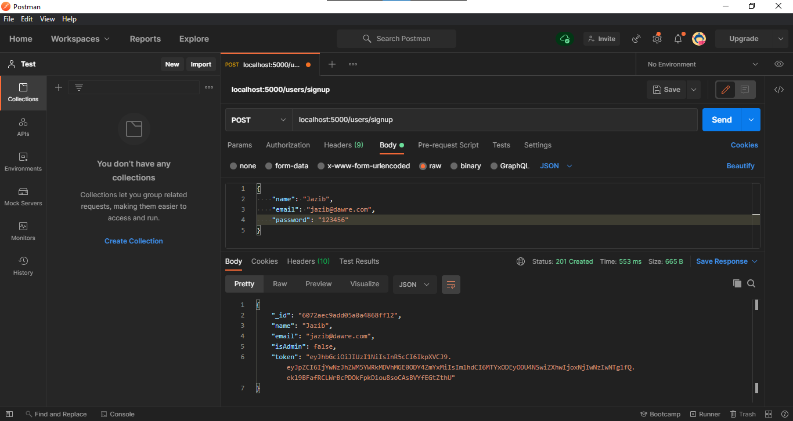

Unsuccessful:

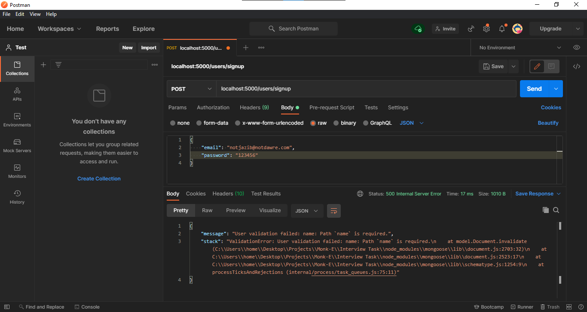

Admin:

The user cannot set himself to admin while registering due to security reasons, hence after normal registeration the isAdmin flag can be set to true by another admin or through the database.

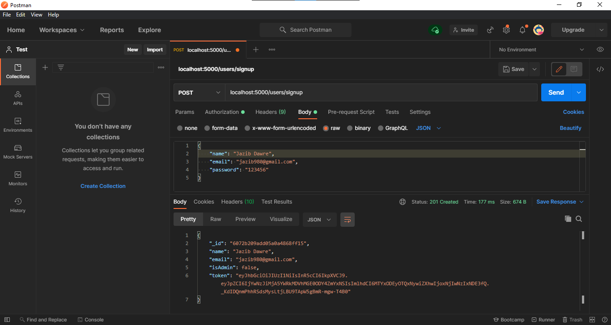

Email sent:

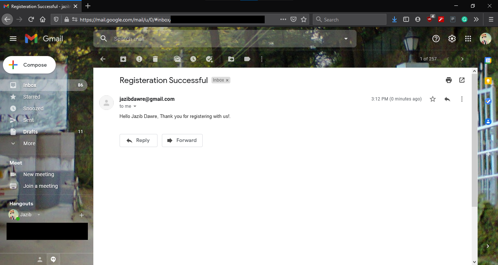

<hr/>

### User Login

Successful:

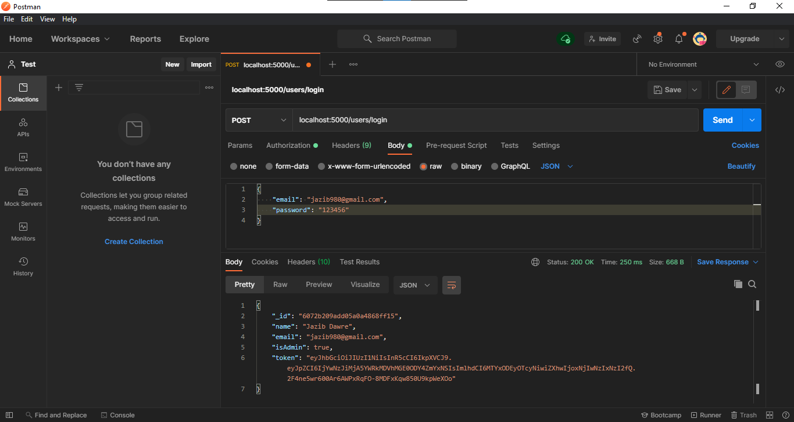

Unsuccessful:

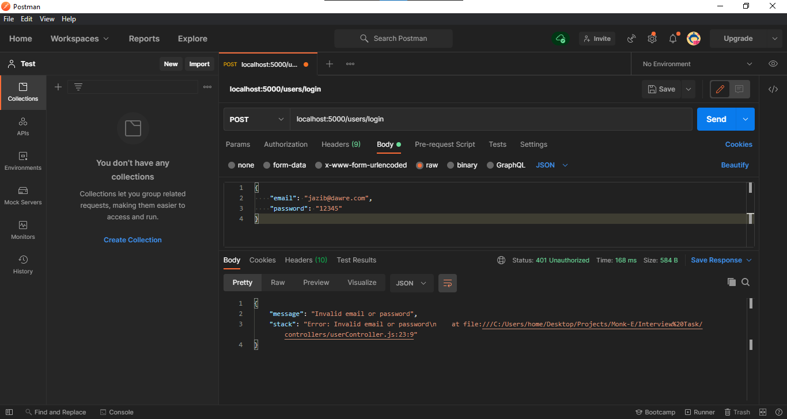

<hr/>

### User Profile

By the user:

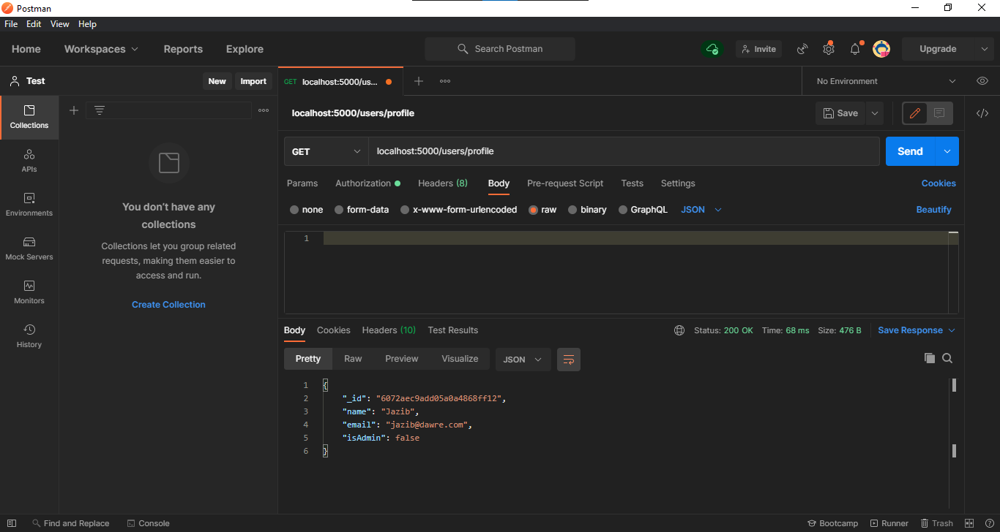

<hr/>

### All Users

By the admin: _Success_

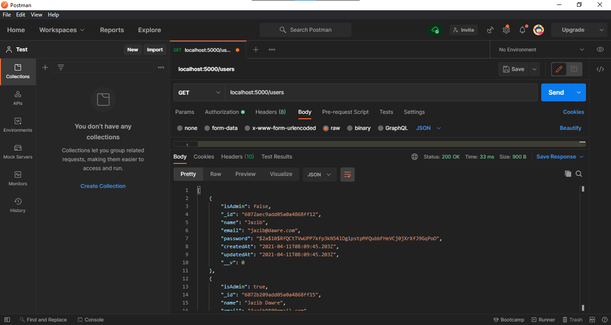

By user: _Error_

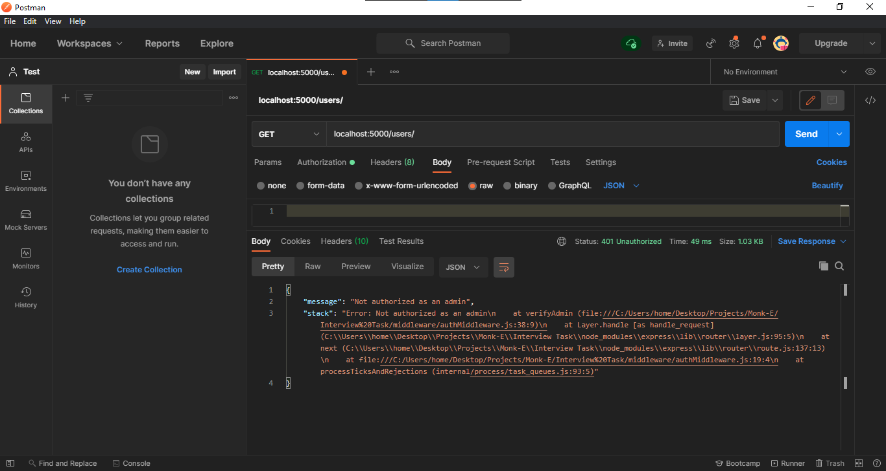

<hr/>

### User Details by ID

By the admin: _Success_

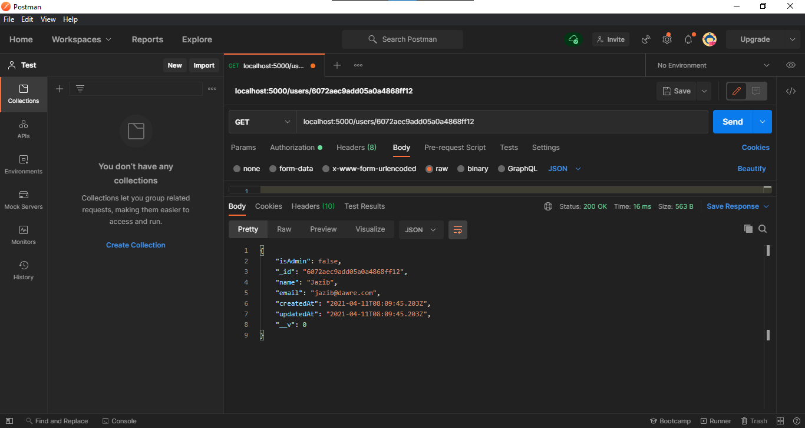

By the user : _Error_

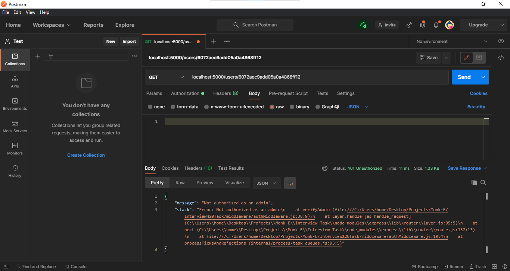

By guest: _Error_

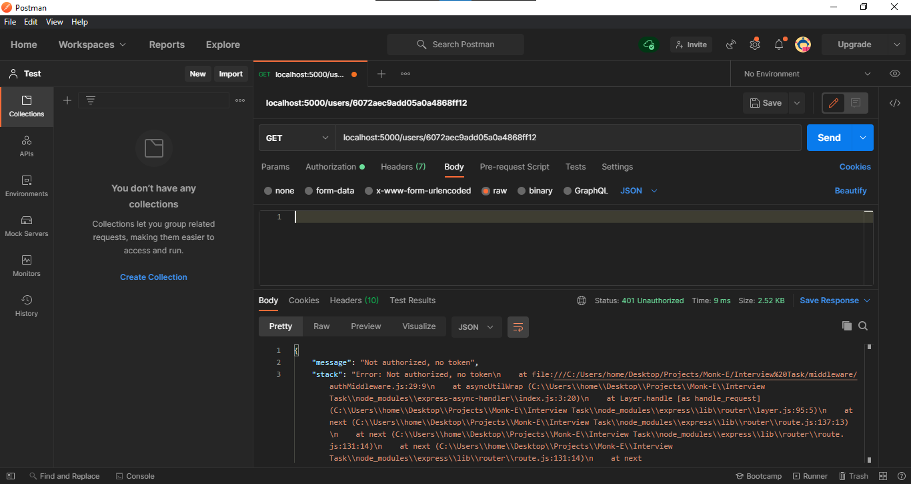

## Possible Improvements

-   Add user verification by using hashes corresponding to the users sent with the email
-   Use OAuth2 for sending mails using packages like `xoauth2`
